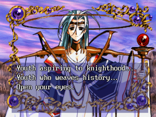
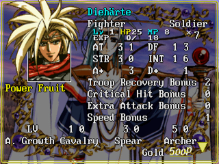
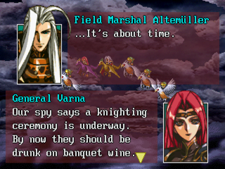
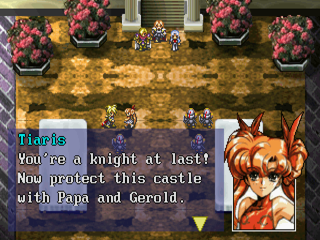
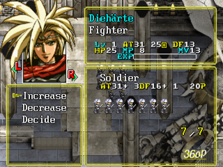
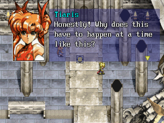
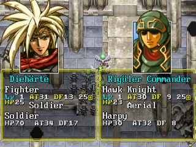
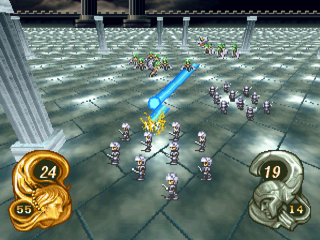

# Langrisser III — English Translation Patch (Sega Saturn)

A work-in-progress English translation patch for *Langrisser III*
(Sega Saturn, Japan), built from the original Japanese disc image.

<table>
  <tr>
    <td></td>
    <td></td>
  </tr>
  <tr>
    <td></td>
    <td></td>
  </tr>
  <tr>
    <td></td>
    <td></td>
  </tr>
  <tr>
    <td></td>
    <td></td>
  </tr>
</table>

## About this patch

*Langrisser III* is a 1996 tactical RPG that never received an
official English release. This patch translates the game's
dialogue, story, and most of the menus into English so it can be
played end-to-end without knowing Japanese.

Character and place names broadly follow the spellings used in
*Langrisser Mobile*, the modern English release of the series.

## Status — v0.6 (work in progress)

This is an unfinished translation. The story can be followed from
start to finish, but expect rough edges:

- Some dialogue lines are still being polished against the original
  Japanese — phrasing may feel awkward in places, and a few lines
  may not yet match the speaker's intent perfectly.
- Several menus, item descriptions, and other UI text are still
  untranslated and will appear as garbled characters in-game.

Future releases will continue to polish the dialogue and replace
the remaining Japanese UI text.

## Playing

The build writes to `build/`:

- `Langrisser_III_English.cue` — load in **Ymir** or **RetroArch + Beetle Saturn**
- `Langrisser_III_English.chd` — load in **RetroArch + Beetle Saturn**
  (only present if you passed `--chd`)

### Emulator compatibility

| Target                              | Music | Text | Character voices |
| ----------------------------------- | :---: | :--: | :--------------: |
| **Real Saturn hardware (Saroo)**    |  ✅   |  ✅  |        ✅        |
| **Ymir** (standalone emulator)      |  ✅   |  ✅  |        ✅        |
| **RetroArch + Beetle Saturn**       |  ✅   |  ✅  |        ✅        |
| **mednafen** (standalone)           |  ?    |  ?   |        ?         |
| **Kronos**                          |  ?    |  ?   |        ?         |

mednafen and Kronos are unconfirmed — reports welcome.

## Building the patch

Requirements:

- Python 3.10+
- Your own Japanese *Langrisser III* disc image (CUE/BIN, with Track
  01 data and audio tracks) — see **Source ISO** below
- Optional: `chdman` (from MAME tools) for CHD output

### Source ISO

The patch is built and tested against the Redump "3M" variant of the
Japanese disc. Track 01 (the data track, where all game files live)
must hash to:

```
SHA-256: 557bfaaa37dc11b6190c46dca8841bc252dfe9f1b3ba8b77ff242843b2bff4c8
File:    Langrisser III (Japan) (3M) (Track 01).bin
Size:    77,178,624 bytes (32,815 sectors × 2,352 bytes)
```

Verify with:

```bash
sha256sum "Langrisser III (Japan) (3M) (Track 01).bin"
```

Other Redump variants of the same Japanese disc are supported by
filename globbing in the build pipeline, but only the (3M) variant
is regression-tested. If your disc dump has a different Track 01
hash, the build may still work but is unverified.

### Steps

```bash
git clone https://github.com/ralfguth/langrisser3-english
cd langrisser3-english

# Configure the JP disc directory once (add to ~/.bashrc to persist):
export LANG3_JP_DIR="/path/to/Langrisser III (Japan)"

python3 build.py
```

The configured directory should contain the `.cue` plus the Track
01 data `.bin` and audio track `.bin` files. You can also override
per invocation with `--jp-iso "/other/path"`.

Add `--chd` to also produce a single-file CHD (recommended for
RetroArch + Beetle Saturn):

```bash
python3 build.py --chd
```

## Credits

- **CyberWarriorX (Theo Berkau)** — Saturn reverse engineering, the
  original v0.2 patch, bigram font system, menu translations.
- **Akari Dawn, ElfShadow, Oogami** — original English translation
  scripts (used as a draft baseline; revised against the Japanese
  source).
- **VermillionDesserts** — independent translation build, D00.DAT
  research.
- **Ralf Guth** — current build pipeline, JP-aligned translation
  pass, font and engine work.

## Legal

This is a fan translation patch for educational and preservation
purposes. You must own a legitimate copy of *Langrisser III (Japan)*
for Sega Saturn. No copyrighted game data is distributed in this
repository.
